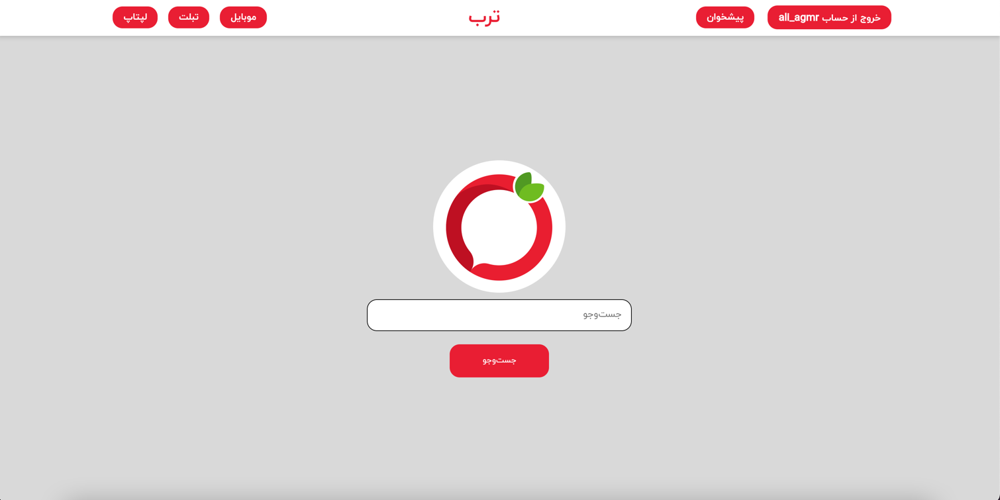
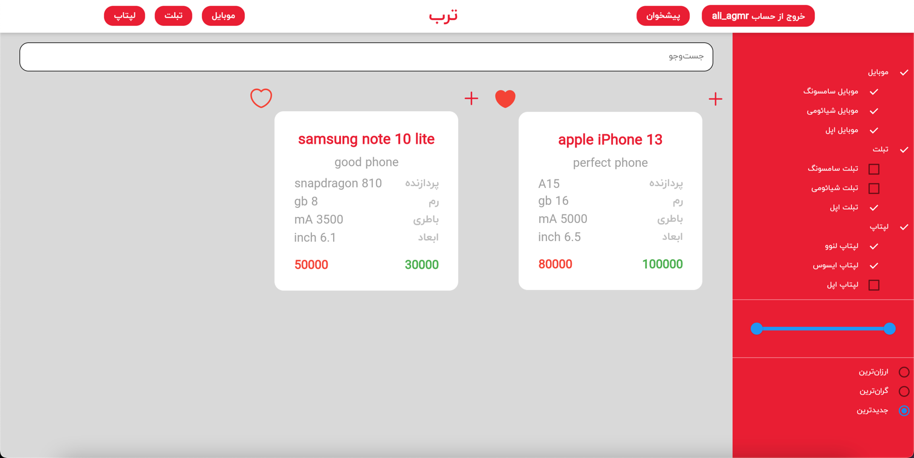
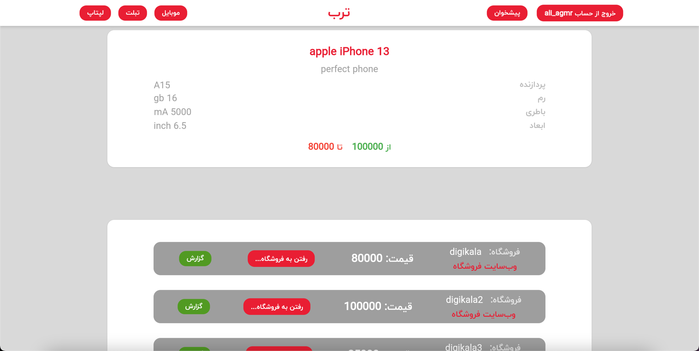
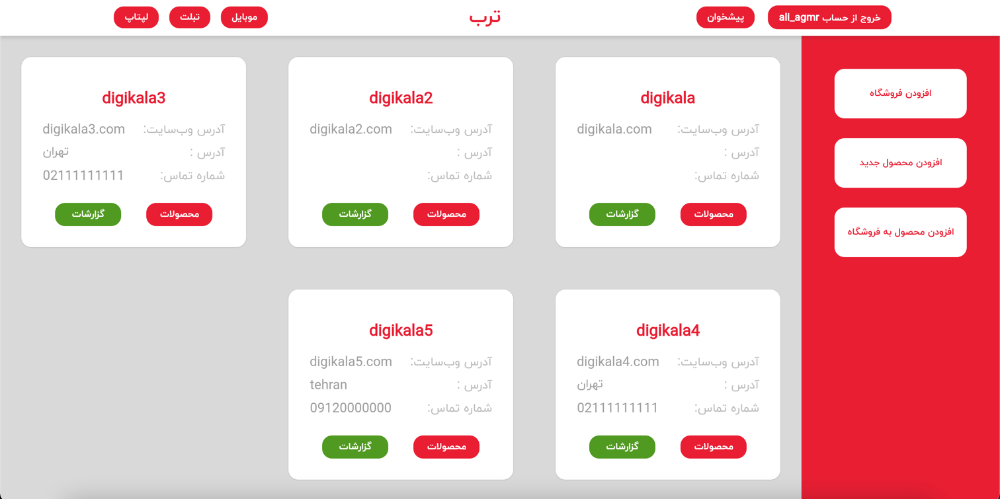
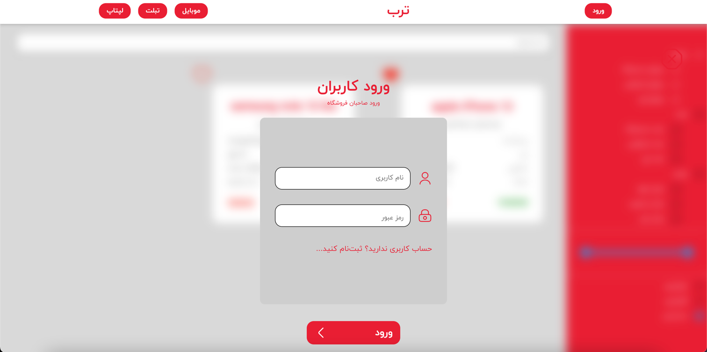
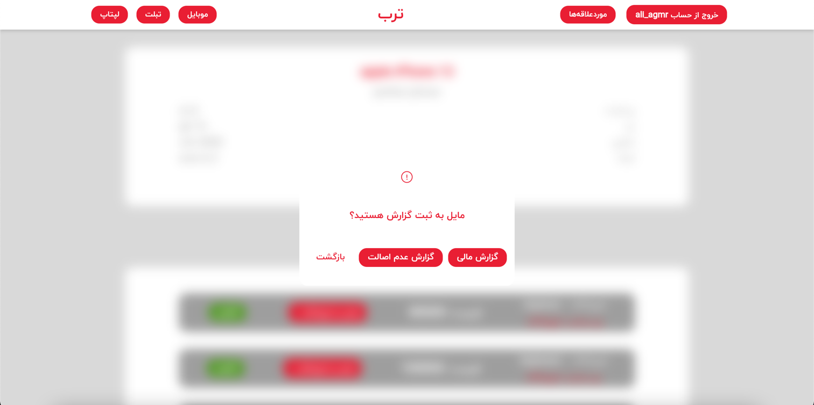

**Torob Website**
___
_Front-end technology used_: Dart, Flutter Web

_Back-end technology used_: Node.js, Express.js

_Database technology used_: PostgreSQL
___
Run the following command to start the app:

```node index.js```
___
Website Screenshots:

Home Page:


        
Product List Page:



Product Detail Page:



Store Owner Dashboard Page:



Login Page:



Report Page:


___
Project repository: [GitHub](https://github.com/aliAgmr/torob_server.git)